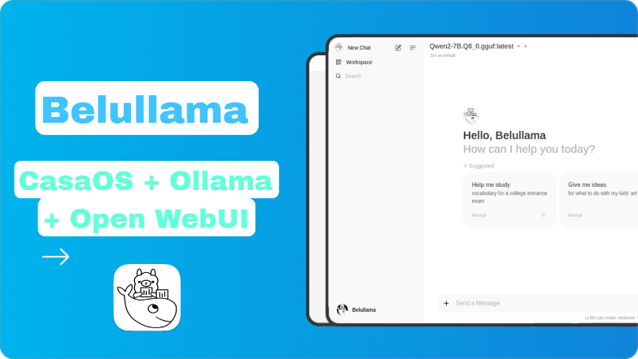
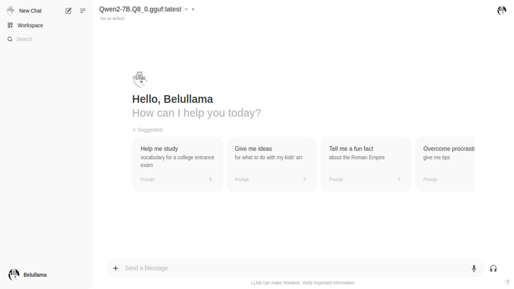
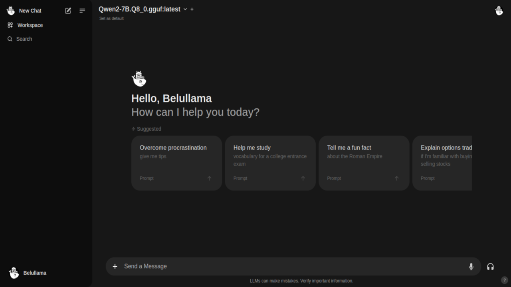

# Belullama


Belullama: A powerful stand-alone AI application bundle!

Belullama is a comprehensive AI application that bundles Ollama, Open WebUI, and Automatic1111 (Stable Diffusion WebUI) into a single, easy-to-use package. It allows you to create and manage conversational AI applications and generate images with minimal setup.

## Table of Contents
- [Introduction](#introduction)
- [Features](#features)
- [Installation](#installation)  - [Stand-alone Installation](#stand-alone-installation)  - [CasaOS Installation (Optional)](#casaos-installation-optional)
- [Usage](#usage)
- [Contributing](#contributing)
- [License](#license)
- [Sources](#sources)

## Introduction

Belullama provides a complete solution for running large language models and image generation models on your local machine. It combines the power of Ollama for running LLMs, Open WebUI for a user-friendly interface, and Automatic1111 for Stable Diffusion image generation.

## Features

- **All-in-One AI Platform**: Belullama integrates Ollama, Open WebUI, and Automatic1111 (Stable Diffusion WebUI) in a single package.
- **Easy Setup**: The stand-alone version comes with a simple installer script for quick deployment.
- **Conversational AI**: Create and manage chatbots and conversational AI applications with ease.
- **Image Generation**: Generate images using Stable Diffusion models through the Automatic1111 WebUI.
- **User-Friendly Interface**: Open WebUI provides an intuitive interface for interacting with language models.
- **Offline Operation**: Run entirely offline, ensuring data privacy and security.
- **Extensibility**: Customize and extend functionalities to meet your specific requirements.


## Installation

### Stand-alone Installation

To install the stand-alone version of Belullama, which includes Ollama, Open WebUI, and Automatic1111, use the following command:

```bash
curl -s https://raw.githubusercontent.com/ai-joe-git/Belullama/main/belullama_installer.sh | sudo bash
```

This script will set up all components and configure them to work together seamlessly.

### CasaOS Installation (Optional)



If you prefer to install Belullama as a CasaOS app, follow these steps:

1. Access your CasaOS server through your web browser.
2. Click the "+" button and select "Install a customized app".
3. Download the Docker file from [here](https://github.com/ai-joe-git/Belullama/blob/main/BelullamaStableDiffusionBETA.yaml).
4. In the CasaOS interface, click "Install" and follow the prompts to complete the installation.

## Usage

After installation, you can start using Belullama:

1. Access Open WebUI through your web browser (the URL will be provided after installation).
2. Use the interface to interact with language models, create chatbots, or generate text.
3. To access Stable Diffusion WebUI, use the provided URL for Automatic1111.
4. Follow the on-screen instructions to generate images or fine-tune models.

For detailed usage instructions, please refer to the documentation in the Belullama repository.

## Screenshots





## Contributing

Contributions to Belullama are welcome! If you have ideas, bug reports, or feature requests, please open an issue in the repository. Pull requests for code improvements or new features are also appreciated.

## License

Belullama is released under the [MIT License](https://opensource.org/licenses/MIT). See the LICENSE file in the repository for details.

## Star History

<a href="https://star-history.com/#ai-joe-git/Belullama&Date"> <picture>   <source media="(prefers-color-scheme: dark)" srcset="https://api.star-history.com/svg?repos=ai-joe-git/Belullama&type=Date&theme=dark" />
   <source media="(prefers-color-scheme: light)" srcset="https://api.star-history.com/svg?repos=ai-joe-git/Belullama&type=Date" />
    </picture>
</a>

## Sources

- [Ollama](https://ollama.com) - Run Llama 3, Mistral, Gemma, and other large language models locally.
- [Open-WebUI](https://openwebui.com) - User-friendly WebUI for LLMs (Formerly Ollama WebUI).
- [Automatic1111](https://github.com/AUTOMATIC1111/stable-diffusion-webui) - Stable Diffusion WebUI.
- [CasaOS](https://casaos.io) - A simple, easy-to-use, elegant open-source Personal Cloud system (optional).
