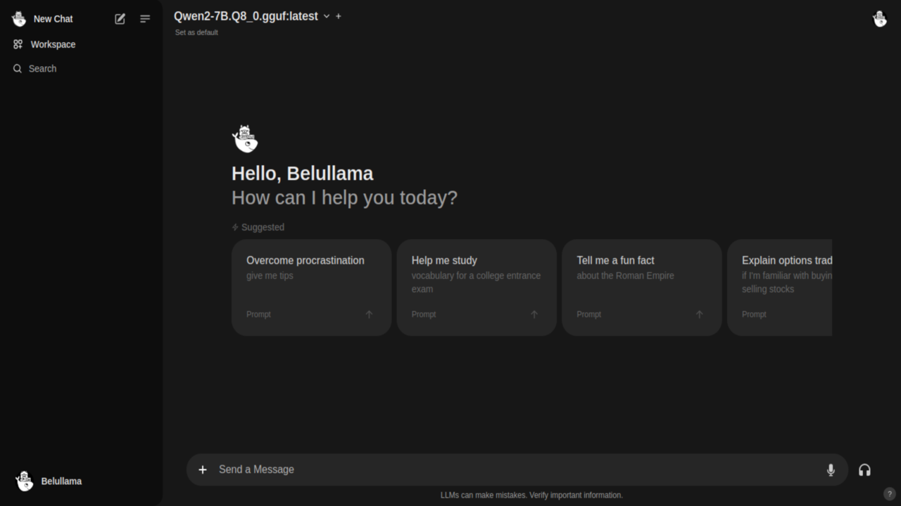

# Belullama Enhanced

A next-generation AI powerhouse with intelligent GPU detection and optimization

Belullama Enhanced is the most comprehensive AI application bundle available, featuring Ollama with DeepSeek-R1 reasoning models, Open WebUI, Automatic1111 (Stable Diffusion WebUI), and ComfyUI into a single, intelligently optimized package. With automatic GPU detection and hardware-specific optimization, it provides unparalleled performance across all system configurations.

## Table of Contents
- [Introduction](#introduction)
- [Features](#features)
- [Installation](#installation)  
  - [🚀 One-Line Installation](#one-line-installation)  
  - [System Requirements](#system-requirements)
  - [🎯 Automatic GPU Detection](#automatic-gpu-detection)
- [What's New in Enhanced](#whats-new-in-enhanced)
- [Usage](#usage)
- [Screenshots](#screenshots)
- [Contributing](#contributing)
- [License](#license)
- [Star History](#star-history)
- [Sources](#sources)

## Introduction

Belullama Enhanced revolutionizes local AI deployment by providing intelligent hardware detection and optimization. It seamlessly combines Ollama with the latest DeepSeek-R1 reasoning models, Open WebUI for intuitive interaction, Automatic1111 for professional image generation, and ComfyUI for advanced AI workflows - all automatically configured for your specific hardware.

## Features

- **🧠 Latest AI Models**: Features DeepSeek-R1 reasoning models with performance comparable to OpenAI-o3
- **🎯 Intelligent GPU Detection**: Automatically detects and optimizes for NVIDIA, AMD, Intel Arc, Intel iGPU, or CPU-only configurations
- **🚀 One-Command Installation**: Complete setup with a single line of code
- **🎨 Complete Image Generation Suite**: Both Automatic1111 and ComfyUI for every image generation need
- **⚡ Hardware-Optimized Performance**: Custom configurations for each GPU type including Intel XPU optimization
- **🔗 Pre-Configured Integrations**: All services work together seamlessly out of the box
- **📊 RAM-Aware Model Selection**: Automatically selects optimal model size based on available system memory
- **🎛️ Modern Terminal Experience**: Beautiful installation process with real-time progress tracking
- **🔒 Complete Privacy**: Runs entirely offline, ensuring data security and privacy
- **🔧 Professional-Grade Setup**: Enterprise-ready configurations with Docker containerization

## Installation

### 🚀 One-Line Installation

Install Belullama Enhanced with automatic GPU detection and optimization:

```
curl -fsSL https://raw.githubusercontent.com/ai-joe-git/belullama/main/installer-enhanced-belullama.sh | bash
```

This intelligent installer will:
- ✅ Detect your GPU hardware (NVIDIA/AMD/Intel/CPU)
- ✅ Install appropriate drivers and runtimes
- ✅ Download optimized models based on your RAM
- ✅ Configure all services for maximum performance
- ✅ Set up seamless integrations between all components

### System Requirements

**Minimum Requirements:**
- 8GB RAM (for DeepSeek-R1 1.5B model)
- 20GB free storage
- Docker support
- Internet connection for initial setup

**Recommended for Optimal Performance:**
- 16GB+ RAM (for DeepSeek-R1 8B model)
- NVIDIA RTX/AMD/Intel Arc GPU
- 50GB+ free storage
- SSD storage

### 🎯 Automatic GPU Detection

Belullama Enhanced automatically detects and optimizes for:

- **🟢 NVIDIA GPUs**: CUDA acceleration with Container Toolkit
- **🔴 AMD GPUs**: DirectML optimization and ROCm support  
- **🔵 Intel Arc GPUs**: Native XPU optimization with custom ComfyUI installer
- **⚪ Intel iGPUs**: Integrated graphics optimization
- **🖥️ CPU-Only**: Optimized CPU inference for systems without dedicated GPUs

## What's New in Enhanced

### 🆕 Latest AI Technology
- **DeepSeek-R1 Models**: State-of-the-art reasoning capabilities comparable to OpenAI-o3
- **ComfyUI Integration**: Advanced node-based workflows for complex AI tasks
- **Intel GPU Support**: First-class support for Intel Arc and integrated graphics

### 🚀 Enhanced Performance  
- **Smart Model Selection**: Automatically chooses DeepSeek-R1 8B or 1.5B based on available RAM
- **GPU-Specific Optimizations**: Custom configurations for each hardware type
- **Native Intel Installation**: Uses specialized Intel XPU installer for maximum performance

### 🔧 Improved User Experience
- **Modern Terminal UI**: Beautiful installation with progress bars and status updates
- **One-Line Installation**: Complete setup with zero configuration required  
- **Comprehensive Health Checks**: Ensures all services are running correctly
- **Detailed Service Information**: Clear URLs and management commands

### 🎨 Complete Creative Suite
- **Dual Image Generation**: Both Automatic1111 and ComfyUI for different workflows
- **Pre-Configured APIs**: All services integrated and ready to use
- **Advanced Workflows**: ComfyUI provides node-based creative pipelines

## Usage

After installation, Belullama Enhanced provides these services:

### 🌐 **Open WebUI** - `http://localhost:3000`
Your primary interface for:
- Conversational AI with DeepSeek-R1 reasoning
- Image generation through integrated Automatic1111
- Model management and configuration

### 🎨 **Automatic1111** - `http://localhost:7860`  
Professional image generation with:
- Stable Diffusion models
- Advanced sampling methods
- Extensive extension ecosystem

### 🎛️ **ComfyUI** - `http://localhost:8188`
Advanced AI workflows featuring:
- Node-based workflow design
- Complex image processing pipelines  
- Custom model integration

### 🤖 **Ollama API** - `http://localhost:11434`
Direct model access for:
- API integrations
- Custom applications
- Model management

## Screenshots


*Open WebUI with DeepSeek-R1 reasoning capabilities*


*Integrated image generation through Automatic1111*

  
*ComfyUI advanced workflow interface*

## Performance Benchmarks

### DeepSeek-R1 Model Performance
- **8B Model**: Recommended for 16GB+ RAM systems
- **1.5B Model**: Optimized for 8-16GB RAM systems
- **Reasoning Capability**: Comparable to OpenAI-o3 performance

### GPU Acceleration Results
- **NVIDIA RTX 4090**: Up to 10x faster inference
- **AMD RX 7900 XT**: Up to 8x faster with DirectML
- **Intel Arc A770**: Up to 6x faster with XPU optimization
- **CPU Optimization**: 2-3x faster than standard configurations

## Management Commands

Control your Belullama Enhanced installation:

```
# View all services status
docker-compose ps

# Restart all services  
docker-compose restart

# Stop all services
docker-compose down

# View logs
docker-compose logs -f

# Update to latest versions
docker-compose pull && docker-compose up -d
```

## Contributing

We welcome contributions to Belullama Enhanced! Areas where you can help:

- **GPU Optimization**: Help improve performance for specific hardware
- **Model Integration**: Add support for new AI models
- **Documentation**: Improve guides and tutorials  
- **Testing**: Report issues with different hardware configurations
- **Feature Requests**: Suggest new capabilities

Please open an issue or submit a pull request on our GitHub repository.

## Troubleshooting

### Common Issues

**Docker Permission Issues:**
```
sudo usermod -aG docker $USER
# Log out and log back in
```

**GPU Not Detected:**
```
# Check GPU status
nvidia-smi  # For NVIDIA
lspci | grep VGA  # For all GPUs
```

**Service Not Starting:**
```
# Check service logs
docker-compose logs [service-name]
```

### Support

- 📖 Check our [Wiki](https://github.com/ai-joe-git/belullama/wiki) for detailed guides
- 🐛 Report bugs in [Issues](https://github.com/ai-joe-git/belullama/issues)
- 💬 Join community discussions in [Discussions](https://github.com/ai-joe-git/belullama/discussions)

## License

Belullama Enhanced is released under the [MIT License](https://opensource.org/licenses/MIT). See the LICENSE file in the repository for details.

## Star History

[](https://github.com/ai-joe-git/belullama)

## Sources & Credits

- [Ollama](https://ollama.com) - Run large language models locally
- [DeepSeek](https://www.deepseek.com) - Advanced reasoning models  
- [Open-WebUI](https://openwebui.com) - User-friendly WebUI for LLMs
- [Automatic1111](https://github.com/AUTOMATIC1111/stable-diffusion-webui) - Stable Diffusion WebUI
- [ComfyUI](https://github.com/comfyanonymous/ComfyUI) - Node-based AI workflow interface
- [Intel Extension for PyTorch](https://intel.github.io/intel-extension-for-pytorch/) - Intel GPU optimization

---

**⭐ If Belullama Enhanced helps your AI projects, please give us a star!**

*Built with ❤️ for the AI community*
